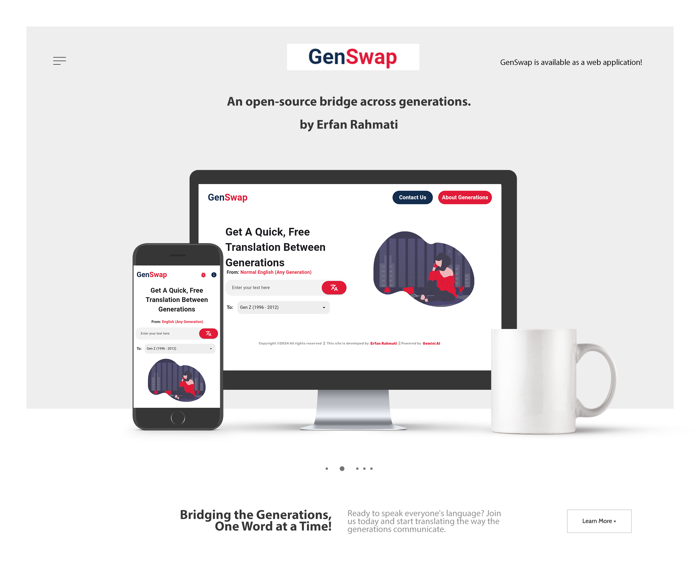

 <p align="center">
      <h1 align="center">GenSwap: Bridging the Generations, One Word at a Time!</h1>
    
<p align="left">
    Ever feel like you're speaking a different language when talking to someone from another generation? GenSwap is here to help! Our unique platform translates slang, phrases, and communication styles between generations, making conversations between Gen Z, Millennials, Gen X, and Boomers seamless and fun.
    
Whether you're trying to decode the latest Gen Z lingo or make your message resonate with Gen X, GenSwap is your go-to tool for breaking down generational language barriers. Perfect for families, friends, coworkers, or anyone looking to understand and connect across age groups.
      
Ready to speak everyone's language? Join us today and start translating the way the generations communicate.
    
[](https://github.com/ErfanRht/GenSwap/releases)
    
    [](https://github.com/ErfanRht/GenSwap/stargazers) 
    [](https://github.com/ErfanRht/GenSwap/network/members) 
    [](https://github.com/ErfanRht/GenSwap/issues) 
    [](https://github.com/ErfanRht/GenSwap/blob/master/LICENSE) 

<p align="center"><a href="https://github.com/ErfanRht/GenSwap/"></a>

## Web App
GenSwap is available as a web application! You can access all the features of our platform directly from your browser. No downloads required. Simply visit:
**[GenSwap Web App](https://erfanrht.github.io/GenSwap/webapp/)**

Start translating generational language in an instant, whether you're on desktop or mobile.

## Getting Started
1. If you don't have Flutter SDK installed; Please visit the official [Flutter](https://docs.flutter.dev/get-started/install) website.
2. Fetch the latest source code from the master branch.
    
``` 
git clone https://github.com/ErfanRht/GenSwap.git
```
    
3. Add api key.
    
<ul>
    
GenSwap uses the Gemini AI to fetch the needed data, so before using it you have to create an account on [Gemini AI website](https://ai.google.dev/gemini-api/docs/api-key), then you can get a free api key in your profile section and apply it to the app by the below steps.
    
- go to `lib/.api.dart`
- you will see the code like this
```dart
final String apiKey = "XXXXXXXXXX";
```
- replace the all `xx..` to your own api key, like this
```dart
final String apiKey = "your_api_key_here";
```
- It's done!
</ul>
    
4. Run the app with Android Studio or Visual Studio. Or the command line.
    
``` 
flutter pub get
flutter run
```

## AI-driven
GenSwap leverages the cutting-edge capabilities of [Google AI Studio](https://ai.google.dev/aistudio?gad_source=1&gclid=CjwKCAjw0aS3BhA3EiwAKaD2ZVxZJ_WnrKckI2v7-fQTah__nlGhALWJdshquKIKhdzCB2r-RksMZxoCOkMQAvD_BwE) to deliver accurate and contextual generational language translations.

## Contribute

I welcome contributions from the community! If you have an idea for an enhancement or have found a bug, you can raise a GitHub issue [here](https://github.com/ErfanRht/GenSwap/issues) or you can follow these steps to contribute:

1. **Fork the repository**
2. **Create a new branch**
    ```sh
    git checkout -b feature/my-new-feature
    ```
3. **Commit your changes**
    ```sh
    git commit -am 'Add some feature'
    ```
4. **Push to the branch**
    ```sh
    git push origin feature/my-new-feature
    ```
5. **Create a new Pull Request**
    
## License
This project is licensed under the [Apache-2.0 License](https://github.com/ErfanRht/GenSwap/blob/master/LICENSE).
    
## Author
This Flutter project is developed by [Erfan Rahmati](https://github.com/ErfanRht).
    
## Contact
You can reach out to me directly at [erfanrht2005@gmail.com](mailto:<erfanrht2005@gmail.com>).
    
## Supporters
[](https://github.com/ErfanRht/GenSwap/stargazers)
[](https://github.com/ErfanRht/GenSwap/network/members)
    
---
    
<div align="center">
    
### Show some ❤️ by starring 🌟 the repository!
    
</div>
